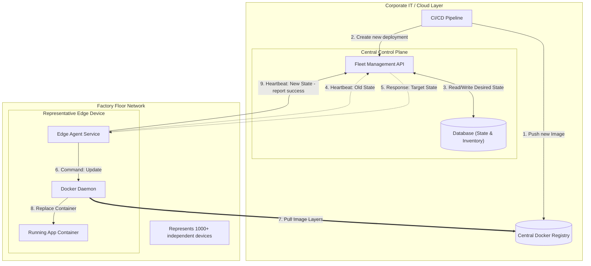

# Senior Software Engineer Case

14.01.2026 interview by [Wojtek Mikusek](https://www.linkedin.com/in/wojciech-mikusek-3b3214152/)

<div @click="$slidev.nav.next" class="mt-12 py-1" hover:bg="white op-10">
  Press Space to start <carbon:arrow-right />
</div>

<div class="abs-br m-6 text-xl">
<a href="https://www.linkedin.com/in/wojciech-mikusek-3b3214152" target="_blank" class="slidev-icon-btn">
    <carbon:logo-linkedin />
  </a>
  <a href="https://github.com/miqs1992/lego-interview" target="_blank" class="slidev-icon-btn">
    <carbon:logo-github />
  </a>
</div>

---

# Table of contents

<Toc text-sm minDepth="1" maxDepth="2" :skip="[1, 2]" />


---

# Architecture



---

# API Specification (part 1)

The API serves as the interface for the different engineering teams to trigger deployments without worrying about which specific 1000+ IP addresses correspond to their production lines. We will treat this as a RESTful API. The core resources are Devices, Groups (to handle the "Types" of lines), and Deployments.

- **Group Management (The Logical Layer)**
  - `GET /groups` See available production line types (e.g., "Molding", "Packaging", "Printing")
  - `POST /groups/{groupId}` Update configuration variables common to all devices in that group

---

# API Specification (part 2)

- **Device Management (Inventory)**
  - `GET /devices` List all edge devices, their health status, current version, and assigned group
    - Filter: `?group=lineTypeA` or `?status=offline`
  - `POST /devices/register` Used during the commissioning of a new line to add a device to the fleet
    - ```json
      Body { 
        "macAddress": "...", 
        "group": "lineTypeB", 
        "name": "Hall 3"
      }
      ```
  - `POST /devices/{id}/heartbeat` Used to determine if device is online and to fetch desired state
    - ```json
      Response { 
        "updateRequired": true,
        "targetImage": "registry.factory.internal/line-a:v1.3.0",
        "imageDigest": "sha256:abcdef1234567890...",
        "deploymentId": "dep-998877",
      }
      ```

--- 

# API Specification (part 3)
- **Deployment Management (The Action Layer)**
  - `POST /deployments` Trigger an update for a specific type of production line
    - ```json
      Body {
        "targetGroup": "Molding",
        "imageUrl": "registry.factory.internal/process-a-app:v2.4.1",
        "imageDigest": "sha256:abcdef1234567890...",
        "signature": "base64-encoded-signature",
        "strategy": "canary", // or all
        "configOverrides": { "THRESHOLD": "0.9" }
      }
      ```
  - `GET /deployments/{id}/status` Check the rollout progress (based on heartbeats from devices)
    - ```json
      Response { 
        "status": "inProgress", 
        "successful": 850,
        "failed": 2, 
        "pending": 148 
      }
      ```
  - `POST /deployments/{id}/rollback` Manually trigger rollback to previous version  
---

# Potential issues (Scenario A)

- The "Bad Update" (Application Crash)
  - Risk: The new Docker container starts but immediately crashes or creates infinite loops, halting production
  - Mitigation (Automatic Rollback): The Edge Agent must include a "Watchdog". After starting the new container, the Agent waits for a "healthy" signal (e.g., an HTTP 200 OK from the app). If the app fails to signal health within 60 seconds, the Agent automatically kills the new container and restarts the previous version

---

# Potential issues (Scenario B)

- Network Saturation
  - Risk: 1000 devices trying to download a 500MB Docker image simultaneously will crush the factory bandwidth.
  - Mitigation (Staggered Rollouts): The API should never command all 1000 devices to update at once. Use a "Rolling Update" logic—update 10 devices, verify success, then update 50, then 100
  - Mitigation (Local Caching): Place a local Docker Registry mirror inside the factory network so devices don't have to reach out to the internet/cloud for every pull

---

# Potential issues (Scenario C)

- Partial Failures (Drift)
  - Risk: 990 devices update, but 10 are offline (power cut). When they come back online weeks later, they are running ancient, incompatible software
  - Mitigation (Eventual Consistency): Since we use a "Pull/State" model, as soon as those 10 devices turn on, they will ask the server for their desired state and immediately self-update to the latest version

---
class: text-center
---

# Thank you


<PoweredBySlidev mt-10 />
